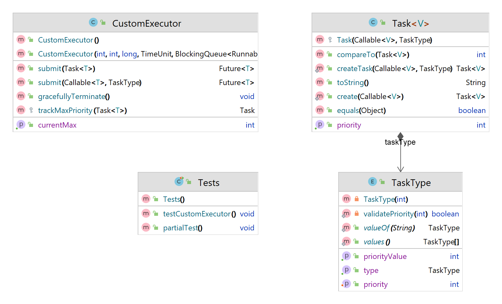

# OOP.ASSIGNMENT2_PART_2

The Java Virtual machine (JVM) schedules threads using a preemptive, priority-based policy.
Every thread has a priority 􏰁 Threads with higher priority are executed in preference to threads with lower priority. When code running in a thread creates a new Thread object, the new thread has its initial priority set automatically equal to the priority of the creating thread.
If a thread was created using a different ThreadGroup, the priority of the newly created thread is the smaller of priority of the thread creating it and the maximum permitted priority of the thread group.
A user may set the priority of a thread using the method: public final void setPriority(int newPriority). The setPriority method changes the priority of a thread. For platform threads, the priority is set to the smaller of the specified newPriority and the maximum permitted priority of the thread group.

# Task

This class is a subclass of FutureTask and implements the Comparable interface. It has a field taskType which is a scheduling priority for the task, and methods to create instances of Task with a specified priority or with a default lowest priority. The compareTo method compares the priorities of two tasks using their getPriority method, and the equals method compares the taskType field of two tasks. The toString method returns a string representation of the task with its priority included.
FutureTask is a cancellable asynchronous computation that implements Runnable and Future. It represents the result of an asynchronous computation, and can be used to execute a computation in a different thread and retrieve the result when it is done.
By extending FutureTask, the Task class can use all the methods and functionality of FutureTask and customize or add additional behavior as needed.

# Custom Executer

subclass of ThreadPoolExecutor that uses a PriorityBlockingQueue as its work queue and has additional methods for submitting tasks with a specified priority. It has a field maxPriority to track the highest priority of a task that has been submitted to the executor, and the submit methods use the trackMaxPriority method to update the maxPriority field when a new task is submitted. The gracefullyTerminate method shuts down the executor and allows all submitted tasks to complete before terminating.

# Diagram uml

# Test
The main test of the assignment is to schedule tasks by priority, the test use one single thread to make the process more clear to the user.

