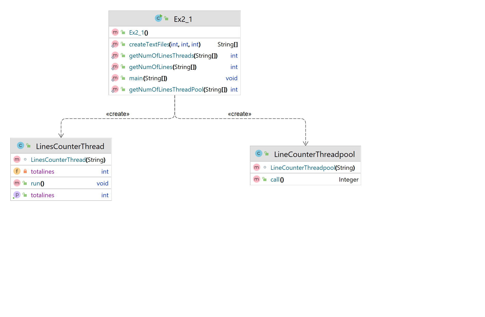

# OOP.ASSIGNMENT 2 Part 1
The purpose of this project is counting number of lines in set of text files.
In class Ex2_1 we have the functions below:

# createTextFiles
first of all we make by request from the main n files, the seed and bound variables are for randomly choose the number of lines in each file. If file created, printed "file_x.txt created" if the file already exists also printed file_x.txt exists,For preventing errors.
The function returns array of strings,containing the file names.

 # getNumOfLines
The function do basic process of counting lines with while loop in each file till the end of the file. Calculating total number of lines in given files from the array.

# getNumOfLinesThreads
The propose of this function is also to calculate total number of lines using threads.
In this function we use LinesCounterThread class,extends from Thread.
Creating LinesCounterThread array, for each file we create object of LinesCounterThread to count the lines with a thread. Using join to wait for all calculates to complete.After all threads are completed 
sum the total lines.
This function using threads separately for each file,the process is correct organized and faster.
But in large numbers of files,make large number of thread  might have two negative effects. First, when a fixed quantity of work is divided among too many threads, each thread receives so little work that the overhead associated with initiating and stopping threads overwhelms the productive work. Second, running an excessive number of threads results in overhead due to the way they compete for limited hardware resources.

# getNumOfLinesThreadPool
This method uses a thread pool to count number of lines in each file with LineCounterThreadpool for each file.
tasks are object of LineCounterThreadpool,for calculate total linnes in each file.all sumbit,returns the number of lines in file.Finally the thread pool shutdowns and wait to all tasks to complete.
Using thread pool allow us to minimize multiple threads managing .

# Conclusion

Experiment  on local machine :

 Test for 2000 files 2 seed 1500 bound:

 30 files 2 seed 120 bound:

The total run time can change few ,depending on machine.

While creating many files with many lines thread pool is good idea to mange all files reading.Above in the example the threadpool much efficient.
But when we create small number of files the time of thread pool not much efficient.
We can assume that sometimes seprate threads are more efficient.
It may happen because when a task is completed, the thread that was executing it becomes idle. If a new task is assigned to the same thread, it will have to switch back into "working" mode, which can involve some overhead. In a thread pool, this context switching can happen more frequently, which can reduce efficiency.

# Uml Diagram

